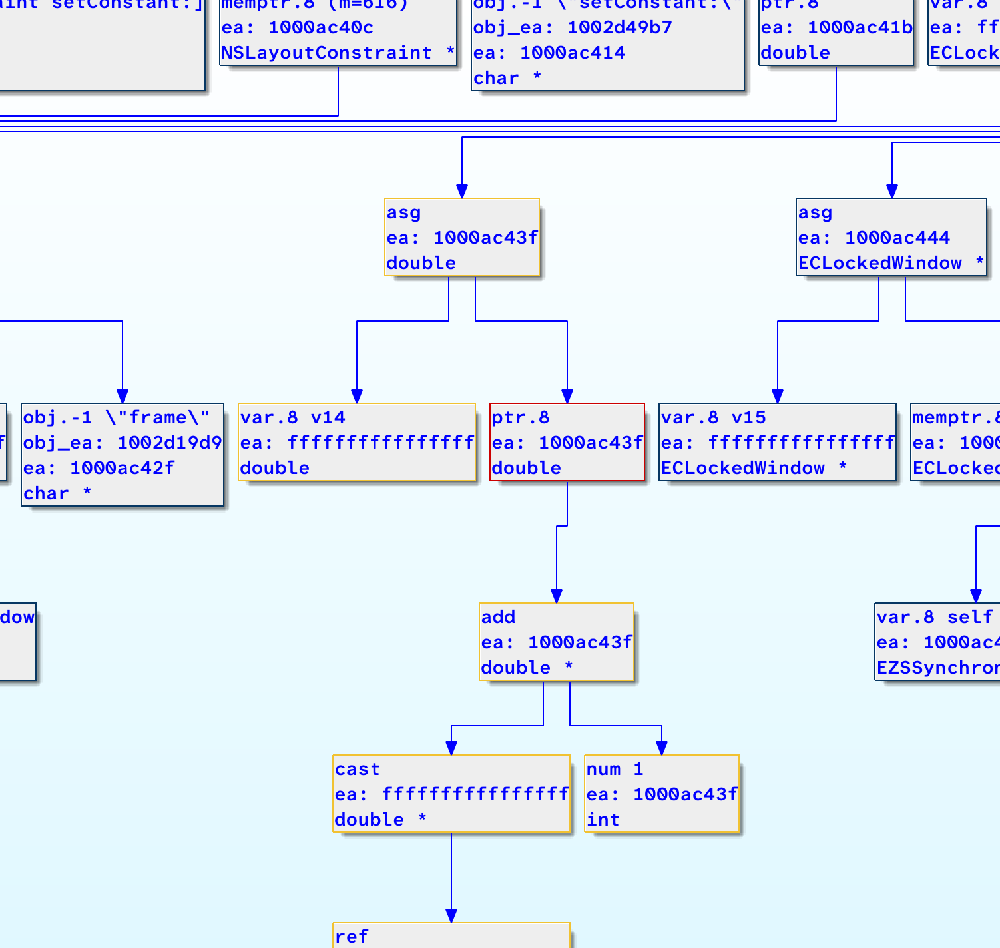
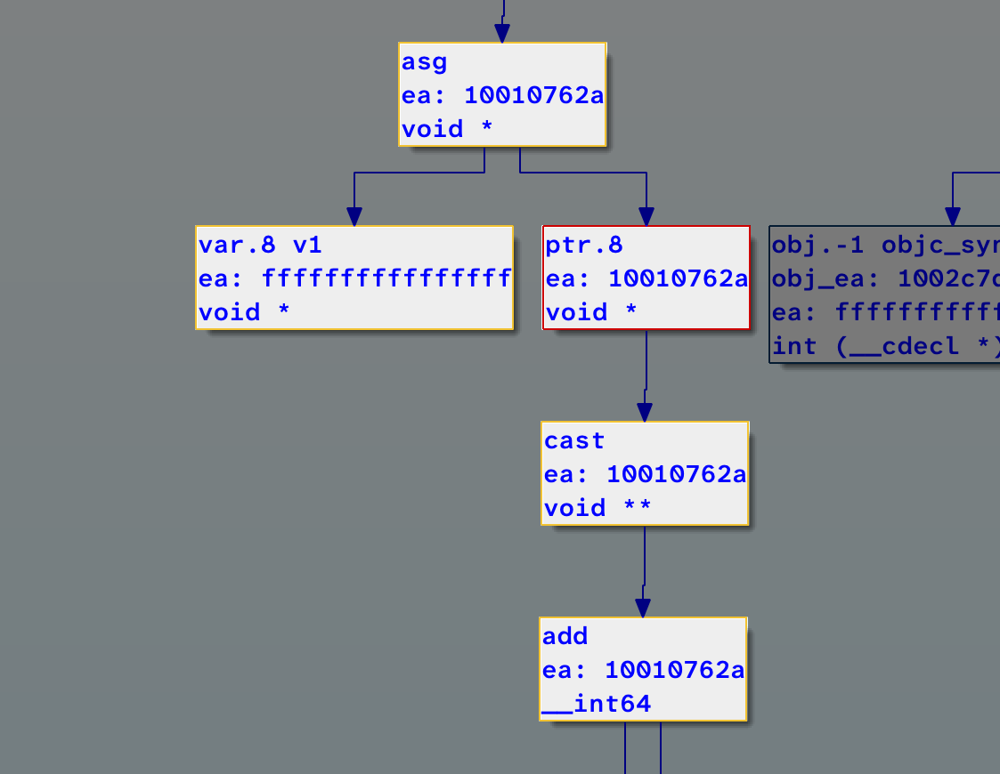
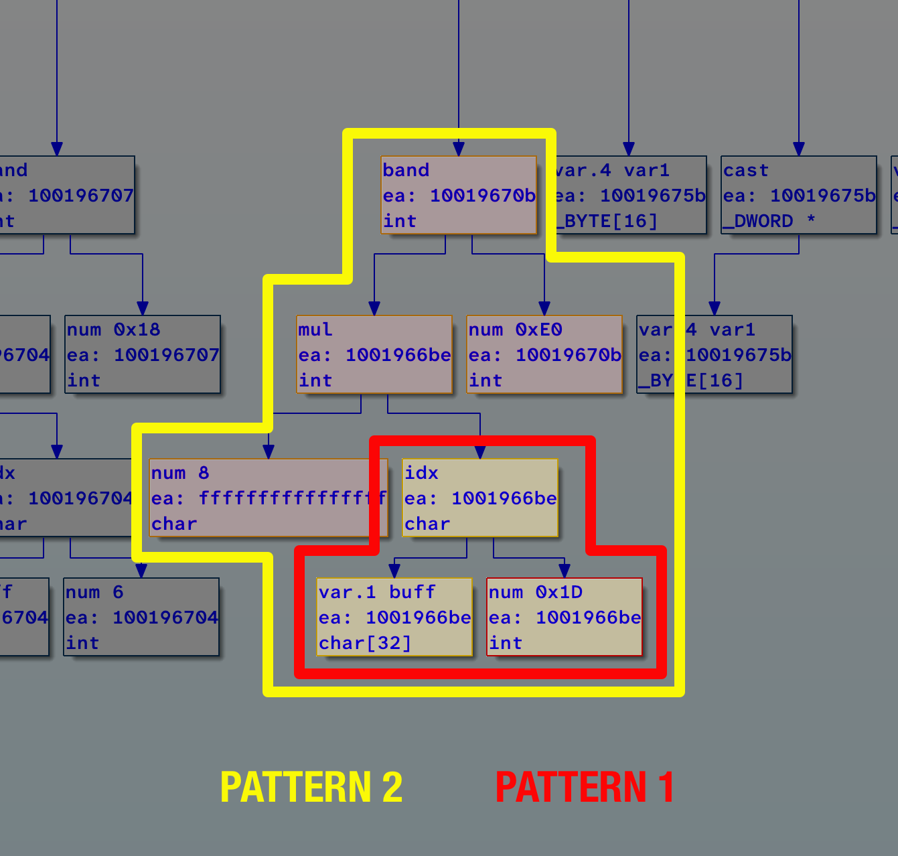

# Declarative AST Pattern Matching for Structure Recovery

## The Problem

Writing AST pattern matching code manually means building a state machine. Every node you visit requires a decision — check this op, branch on that child, track where you are, handle what happens when something unexpected appears. Every new pattern is another case, another handler, another place where something deeper or more complex gets misinterpreted. The code grows but the confidence doesn't.



The patterns were already visible in the decompiler graph — types at predictable positions, offsets consistent across code, the same structural shapes repeating. The problem wasn't finding the patterns. It was that there was no way to describe exactly what you saw and match against it directly. You had to approximate through traversal code instead of specifying it precisely.

Slice is the answer. Think of it as SQL for the AST — declare the exact tree structure you want to match, and the framework handles traversal, comparison, and extraction. If the tree matches the specification, the rule fires. If it doesn't, nothing happens.

---

## What is a Slice



A Slice expresses a connected structure — think of it like a molecule. The decompiler's C tree is made of these molecules, each one a small connected subgraph of expression nodes. A Slice lets you describe exactly the molecule you're looking for: the base node type, what's connected to it, what's connected to that — as deep as you need.

The key property is certainty. A Slice is a formula — a precise structural specification with no ambiguity. The formula either matches the molecule completely or it doesn't match at all. Partial matches don't exist. You define it once, you know exactly what it will find.

This separates two things that manual traversal conflates — what you're looking for and how to find it. With Slice you only think about what.

---

## Matching, Priority and Conflict Resolution



When multiple rules are defined, conflicts are inevitable. Consider two rules — one matching H2O, another matching CaSO4·2H2O, which contains H2O inside it. Both would match the same node. Which fires first?

Suture resolves this through complexity. A Slice describing more nodes is scored higher and runs first. Once it matches and claims a molecule, that molecule is marked as used. The simpler rule finds nothing — the molecule was already claimed.

You never have to think about rule ordering manually. More specific patterns always take precedence. The tree gets partitioned cleanly — each molecule claimed by exactly the rule that describes it most precisely.

---

## Before and After

Consider matching `*(void **)(a1 + 0x20)` — a dereferenced cast of a pointer arithmetic expression.

Manual traversal:

```python
if (i.op is idaapi.cot_ptr and
    i.x.op is idaapi.cot_cast and
    i.x.x.op is idaapi.cot_add and
    i.x.x.x.op is idaapi.cot_var and
    i.x.x.y.op is idaapi.cot_num):
```

With Slice:

```python
Slice(cot_ptr,
    x=Slice(cot_cast,
        x=Slice(cot_add,
            x=cot_var,
            y=cot_num
        )
    )
)
```

The manual version isn't just harder to read — it's a state machine. You track position in the tree, branch on each node type, and manage failure at every step. The code encodes traversal logic, not the pattern itself. Adding a variation means another branch wired into the same machine.

The Slice version is the pattern. If any node doesn't match, the whole match fails cleanly. No partial state, no silent errors. A pattern two levels deeper is one more level of nesting — nothing else changes.

---

## Extraction

With Slice, matching and extraction happen in one step. Nodes come back indexed in definition order:

```python
Slice(cot_ptr,          # [0] the root
    x=Slice(cot_cast,   # [1] the cast
        x=Slice(cot_add,# [2] the addition
            x=cot_var,  # [3] the variable
            y=cot_num   # [4] the number
        )
    )
)

# items[3] is the var node, items[4] is the num node
```

---

## What Suture Enables

To see the practical difference, consider two patterns that appear constantly in compiled C++ — a direct field access and a virtual dispatch through a vtable.

A direct field access like `*(void **)(a1 + 0x20)` is straightforward:

```python
class FieldAccess1(Rule):
    @property
    def pattern(self) -> Slice:
        return ParsePattern("""
            i.op is idaapi.cot_ptr and
            i.x.op is idaapi.cot_cast and
            i.x.x.op is idaapi.cot_add and
            i.x.x.x.op is idaapi.cot_var and
            i.x.x.y.op is idaapi.cot_num
            """)

    def extract(self, items):
        return RuleExtractResult(AccessInfo(items[4].numval(), items[0].type), self)
```

A virtual dispatch goes one level deeper — the pointer is itself dereferenced through a vtable before the offset is applied:

```python
class VirtualDispatch(Rule):
    @property
    def pattern(self) -> Slice:
        return ParsePattern("""
            i.op is idaapi.cot_ptr and
            i.x.op is idaapi.cot_cast and
            i.x.x.op is idaapi.cot_add and
            i.x.x.x.op is idaapi.cot_ptr and
            i.x.x.x.x.op is idaapi.cot_cast and
            i.x.x.x.x.x.op is idaapi.cot_var and
            i.x.x.y.op is idaapi.cot_num
            """)

    def extract(self, items):
        return RuleExtractResult(AccessInfo(0, AccessInfo(items[6].numval(), items[0].type)), self)
```

`ParsePattern` accepts HRDevHelper-style syntax and compiles it into a `Slice` under the hood — the `i.x.x.x` here is navigation shorthand borrowed from the tool, not traversal logic. There is no state machine behind it. The pattern is still a formula; the framework still owns the traversal.

Both rules match at the same root node type — `cot_ptr`. In manual traversal code, distinguishing them means adding branches inside the same handler. In Suture, they're two separate classes. `VirtualDispatch` describes more nodes, so it scores higher and fires first. If it matches, `FieldAccess1` never sees that node. If it doesn't, `FieldAccess1` gets its turn.

Adding a new access pattern — say, a doubly-nested vtable call through an offset — is another class. Nothing else changes. No existing rule is touched, no branching logic is extended. The ruleset has over twenty rules in production and each one was added the same way: define the shape, define the extraction, done.