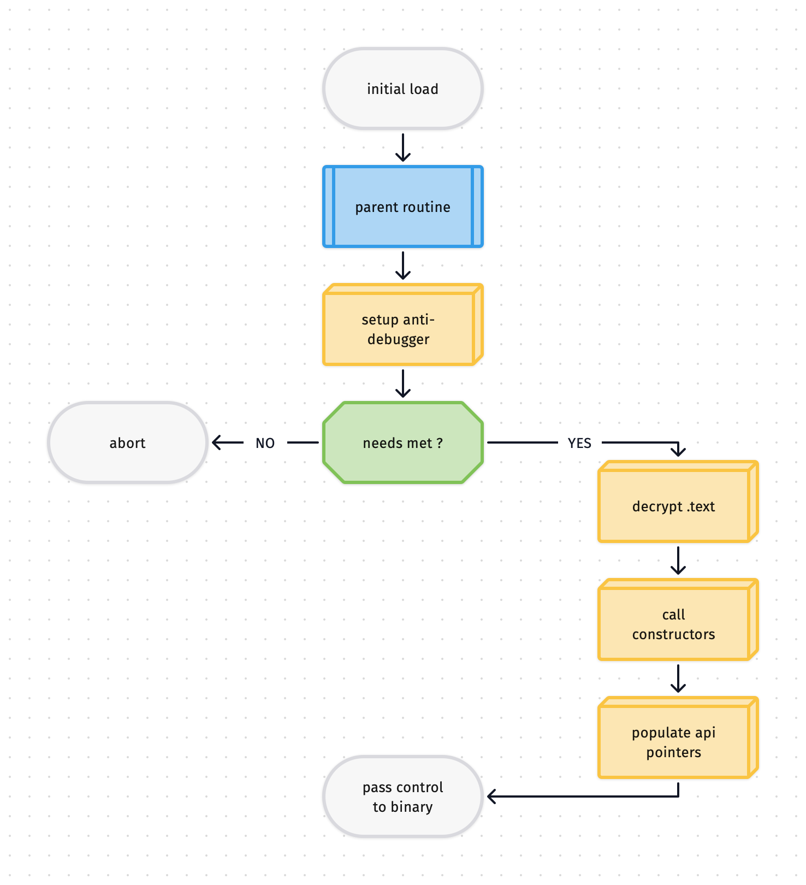
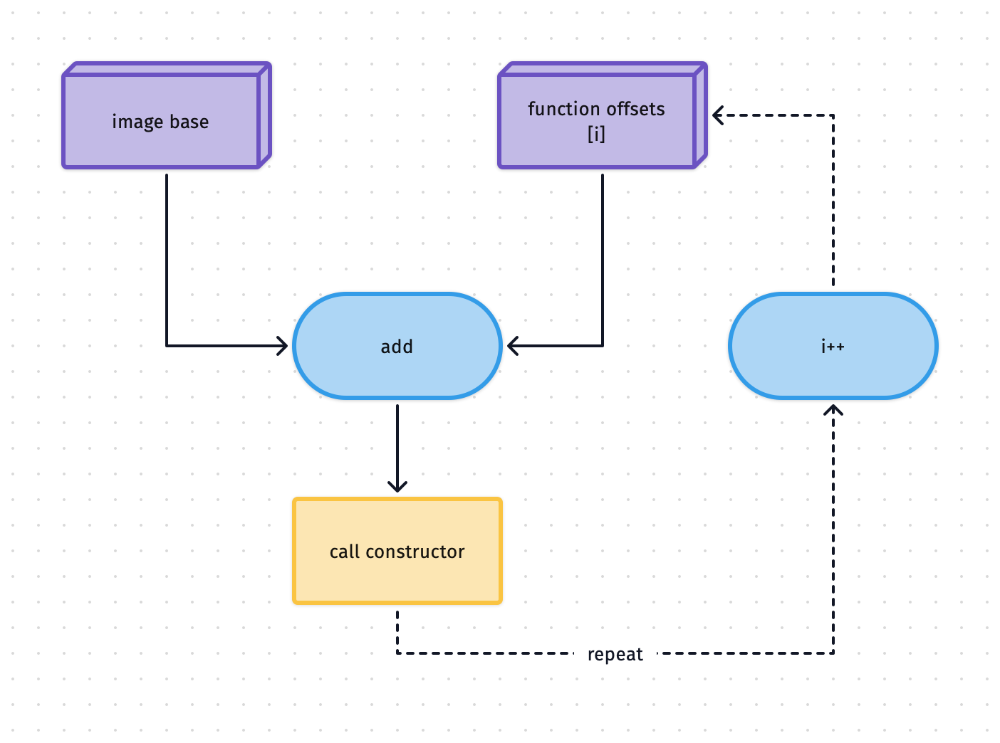
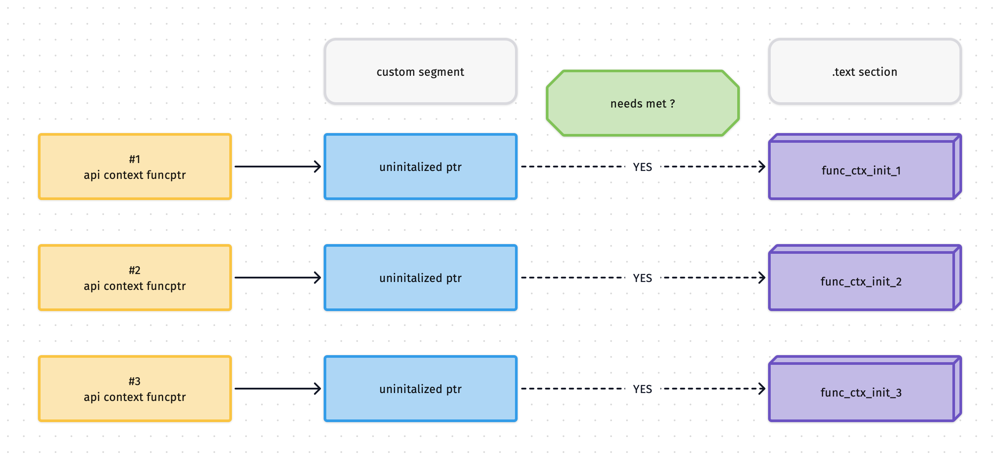
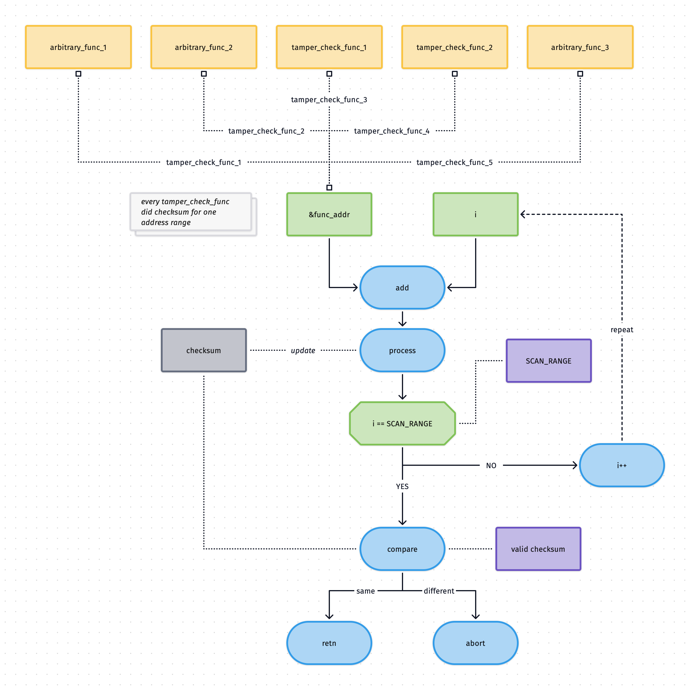

## Analyzing Multi-Layer Runtime Protection in a macOS Dynamic Library

While reverse engineering a protected macOS dynamic library, I encountered several layers of runtime protection that significantly reduced the value of traditional static analysis. This write‑up describes the protection design and the high‑level approach used to analyze it.

## Protection Overview

The binary used a defense‑in‑depth approach, where multiple mechanisms worked together:

* **Reflective code loading** – hides verification and decryption logic from static analysis.
* **Anti‑debugging** – custom exception handling interferes with normal debugger behavior.
* **Encrypted `.text` section** – executable code remains encrypted until runtime checks pass.
* **Dynamic constructor resolution** – constructors are resolved and invoked at runtime instead of being visible statically.
* **Symbol indirection** – a custom segment obscures exported API symbols needed for initialization.
* **Integrity verification** – continuous checksum validation detects `.text` section modifications.

Each layer depends on the others, which makes isolated analysis difficult.

## Control Flow Overview

## Pre‑Flight Execution

Most initialization logic runs inside a parent routine. Since the `.text` section is encrypted, this raises an obvious question: what code executes first?

The initial constructor is not a standard function pointer into `.text`. Instead, it points into a custom RX segment. That segment loads the real parent routine using **reflective code loading**, implemented through `NSCreateObjectFileImageFromMemory`. This technique is well documented by security researchers[^1].

In this design, the payload is stored encrypted and only decrypted in memory right before being passed to the loader, keeping it hidden from static inspection.

## Protection In‑Depth

### Layer 1: Anti‑Debugging

The binary installs a custom exception handler that alters normal debugger behavior. Because integrity checks monitor executable memory, software breakpoints trigger detection. Hardware breakpoints avoid code modification, but the custom handler intercepts exceptions before the debugger can act. This makes interactive debugging unreliable.

### Layer 2: Encrypted `.text` Section

The entire `.text` section appears encrypted in static disassembly. Only a single visible constructor exists, which invokes the parent routine responsible for runtime checks. No real executable code is accessible until those checks succeed.

### Layer 3: Dynamic Constructor Resolution

A bootstrap constructor decrypts the `.text` section and executes further initialization routines. These constructors are resolved by adding offsets from a lookup table to the library’s base address.

By avoiding the standard `__mod_init_func` section, the binary hides its initialization flow from static tools.

### Layer 4: API Export Obfuscation

The library exports several functions required for API setup. Instead of exposing them directly, the export table points into a custom segment. These pointers are populated with real function addresses only after successful initialization.

### Layer 5: Continuous Integrity Verification

Dedicated routines continuously compute checksums over selected memory regions. These routines validate each other and terminate the process if unexpected changes are detected.

## Analysis Approach

### Initial Reconnaissance

Static inspection of the Mach‑O structure revealed little. The `.text` section was encrypted, and the only executable segment relied heavily on C++ constructs, limiting visibility.

### Runtime‑Focused Analysis

The analysis focused on:

* Inspecting the parent Mach‑O image after decryption and reflective loading.
* Observing how custom exception handling interfered with debuggers.
* Extracting executable memory after the decryption phase.
* Recovering constructor addresses using image‑base‑relative offsets.
* Inspecting API pointer data stored in custom segments.
* Reconstructing a valid Mach‑O from extracted memory for convenient static analysis.
* Tracking interactions between integrity‑check routines.

### Automation

To support static analysis, I built a custom Mach‑O reconstruction tool and automated the debugger to extract constructor offsets, runtime-resolved API pointers, and modify anti-debugging state.

## Challenges

Since static analysis of the protected binary provided limited value, the analysis shifted toward identifying trust boundaries and externally exposed attack surfaces. This involved focusing on reflective loading via the well‑known Apple API NSCreateObjectFileImageFromMemory and analyzing the dynamically loaded parent image, where traditional inspection techniques became viable.

Contributing factors included the bootstrap binary exposing unstripped symbols, which improved visibility into its initialization logic. The anti‑debugging mechanisms depended on mutable runtime state, and once that assumption was no longer enforced, debugger interference was reduced, allowing controlled runtime observation. Additionally, the binary did not enforce the PT_DENY_ATTACH mechanism, so even if runtime analysis failed, partial inspection remained possible through Mach-O binary reconstruction using in-memory data.

## Key Observations

The strength of the protection comes from how tightly the layers interact. Integrity checks protect executable memory, while anti‑debugging limits runtime control. Dynamic constructors and symbol indirection hide the library’s structure. Although static analysis was partially possible, most insight depended on runtime observation. This case illustrates how even minor oversights in protection design—such as exposed symbols or unchecked runtime state—can significantly reduce the overall effectiveness of protection.

## Experience

This project required building ad‑hoc tooling to accelerate analysis under heavy runtime protection:

* Automated the debugger to capture constructor offsets, runtime‑resolved API pointers, and modify anti‑debugging state to restore reliable debugging control.
* Implemented Mach‑O reconstruction to restore decrypted code and initialization flow for static analysis.
* Reduced manual debugging by converting runtime observations into repeatable automation.

[^1]: Red Canary – Reflective Code Loading
